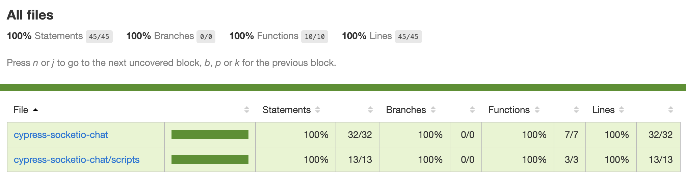

# cypress-socketio-chat with tests

[![ci status][ci image]][ci url] [![badges status][badges image]][badges url] [![renovate-app badge][renovate-badge]][renovate-app] 
> Example testing real-time [Socket.io](https://socket.io/) chat using [Cypress.io](https://www.cypress.io/)

The original chat program copied from [dkhd/node-group-chat](https://github.com/dkhd/node-group-chat) as described in 
[Build A Group-Chat App in 30 Lines Using Node.js](https://itnext.io/build-a-group-chat-app-in-30-lines-using-node-js-15bfe7a2417b)
blog post.

## Blog posts

Testing a Socket.io chat application can be done in several ways. Read the following blog posts to see the alternatives.

Title | Description
---|---
[Test a Socket.io Chat App using Cypress](https://glebbahmutov.com/blog/test-socketio-chat-using-cypress/) | Simulates the second user by connecting to the chat server from the plugins file
[Run Two Cypress Test Runners At The Same Time](https://glebbahmutov.com/blog/run-two-cypress-runners/) | Launches two test runners, giving them separate specs to run
[Sync Two Cypress Runners via Checkpoints](https://glebbahmutov.com/blog/sync-two-cypress-runners/) | Launches two test runners, which stay in sync by communicating via their own Socket.io server
[Code Coverage For Chat App](https://glebbahmutov.com/blog/code-coverage-for-chat-tests/) | Instruments and measures the fullstack code coverage

Flip through the presentation slides [E2E Testing For A Real-Time Chat Web Application](https://slides.com/bahmutov/e2e-for-chat)

## Specs

Name | Description
---|---
[first-spec](./cypress/integration/first-spec.js) | Tests that the user can post a message and see it
[random-name-spec.js](./cypress/integration/random-name-spec.js) | Creates a random user name for the test
[client-api-spec.js](./cypress/integration/client-api-spec.js) | Invokes events as a 2nd user using app actions
[socket-spec.js](./cypress/integration/socket-spec.js) | Mimics the 2nd user by connecting to the Socket.io server from the plugin file
[socket-from-browser-spec.js](./cypress/integration/socket-from-browser-spec.js) | Mimics the 2nd user by connecting to the Socket.io server from the spec file
[mock-socket-spec.js](./cypress/integration/mock-socket-spec.js) | The test forces the app to use a mock socket object instead of the real connection, see [video](https://youtu.be/soNyOqpi_gQ)
[disconnect-spec.js](./cypress/integration/disconnect-spec.js) | Checks if the user disconnects correctly

## Code coverage

Added instrumenting front-end code using `istanbul-lib-instrument` module, see [index.js](./index.js) file. Read the blog post [Code Coverage For Chat App](https://glebbahmutov.com/blog/code-coverage-for-chat-tests/).

Note: I did not use [Istanbul middleware](https://github.com/gotwarlost/istanbul-middleware#readme) because it seemed to not support ES6 syntax (the middleware module had no releases for a long time).

[ci image]: https://github.com/bahmutov/cypress-socketio-chat/workflows/ci/badge.svg?branch=main
[ci url]: https://github.com/bahmutov/cypress-socketio-chat/actions
[badges image]: https://github.com/bahmutov/cypress-socketio-chat/workflows/badges/badge.svg?branch=main
[badges url]: https://github.com/bahmutov/cypress-socketio-chat/actions
[renovate-badge]: https://img.shields.io/badge/renovate-app-blue.svg
[renovate-app]: https://renovateapp.com/
